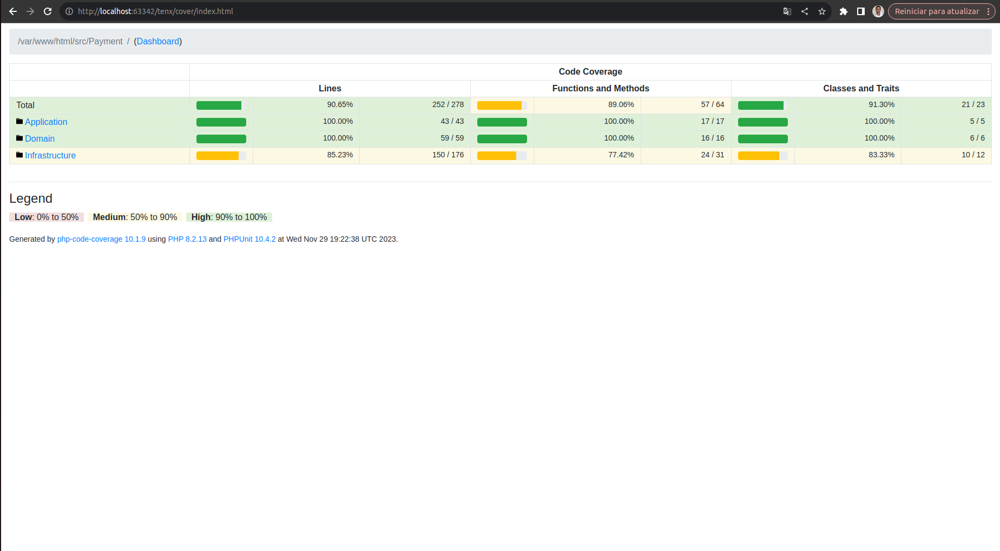

# Tenx Gateway de Pagamento

Esse projeto consiste em uma API HTTP atuando como gateway para facilitar a integração com o Asaas.

Esse projeto consiste em uma API HTTP atuando como um Microservice, desenvolvido em [Laravel](https://laravel.com/), para criar usuários e criar ordens de pagamento e confirmar o mesmo. disponíveis na versão `8.2` em diante do PHP.

## Requisitos

Esse projeto exige a utilização do [Docker](https://www.docker.com/) localmente. Além disso, para uma melhor interação com os containers, é importante ter instalado também o comando [make](https://linux.die.net/man/1/make).

## Instalação

Para instalar o projeto e suas dependências, basta utilizar o seguinte comando make:

bash
make docker-build

Colocar as envs no file `.env`

`ASAAS_BASE_URI=https://sandbox.asaas.com/api/`
`ASAAS_API_KEY=$aact_YTU5YTE0M2M2N2I4MTliNzk0YTI5N2U5MzdjNWZmNDQ6OjAwMDAwMDAwMDAwMDAwNjk2NDk6OiRhYWNoX2RiMDRlMmYwLTcwYmMtNGE0Mi04ZTE4LTBiMmVkMjdiNDY5ZQ==`

## Testes

Para executar todos os testes do projeto, o comando abaixo pode ser emitido:

bash
make docker-test

## Comandos make

O arquivo `Makefile`, contido na raíz do projeto, possui os comandos mais frequentes para poder interagir com os containers Docker. Abaixo está uma descrição dos principais deles:

| Comando              | Descrição                                          |
|----------------------|----------------------------------------------------|
| `make docker-build`  | Faz o build do projeto.                            |
| `make docker-test`   | Executa todos os testes da aplicação.              |
| `make docker-up`     | Executa instrução `up` dos containers necessários. |
| `make docker-down`   | Executa instrução `down` de todo os containers.    |
| `make coverage-html` | Gera o coverage da aplicação                       |

## Documentação de API
Abaixo é possivel ter mais informações sobre os endpoints gerados a partir desse projeto, tanto na especificação OpenAPI quanto em uma collection pronta para ser importada no Postman:

- [Collection Postman](docs/collection_tenx.json)

## Requisitos

Esse projeto exige a utilização do [Docker](https://www.docker.com/) localmente. Além disso, para uma melhor interação com os containers, é importante ter instalado também o comando [make](https://linux.die.net/man/1/make).

## Coverage
90.65%

